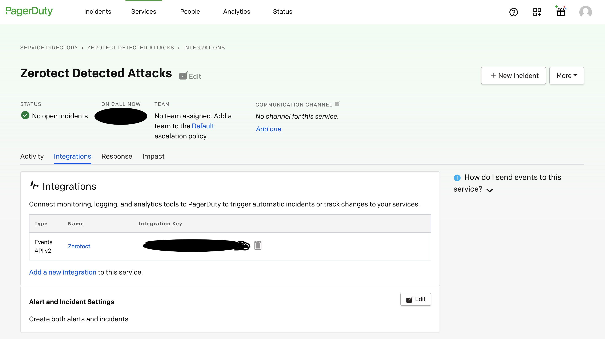
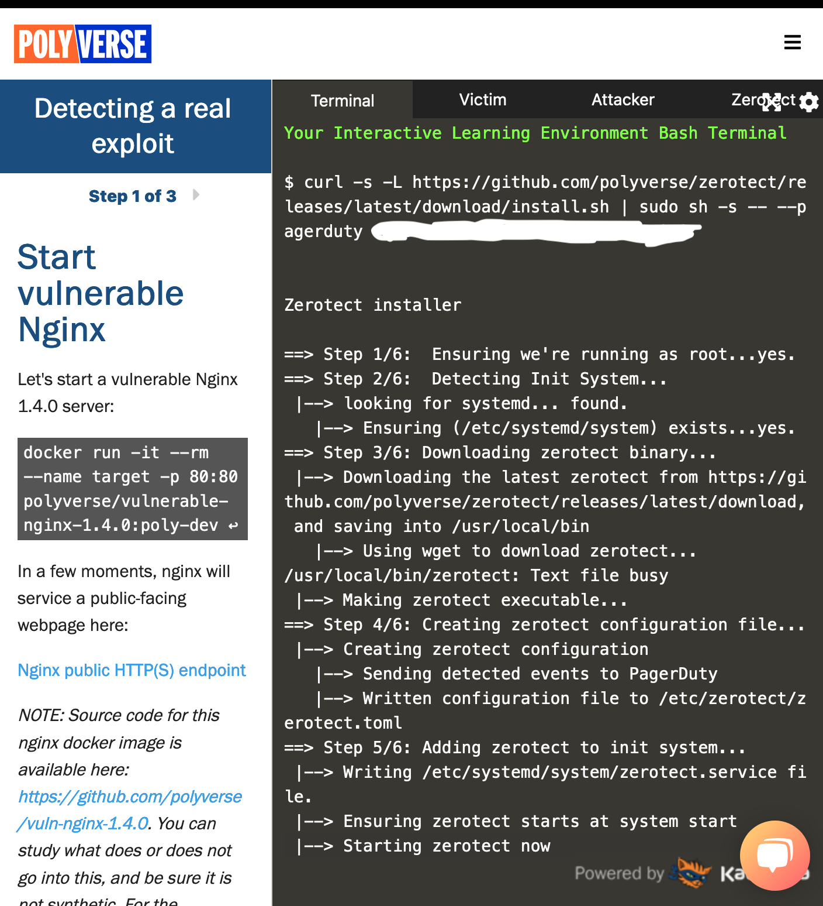
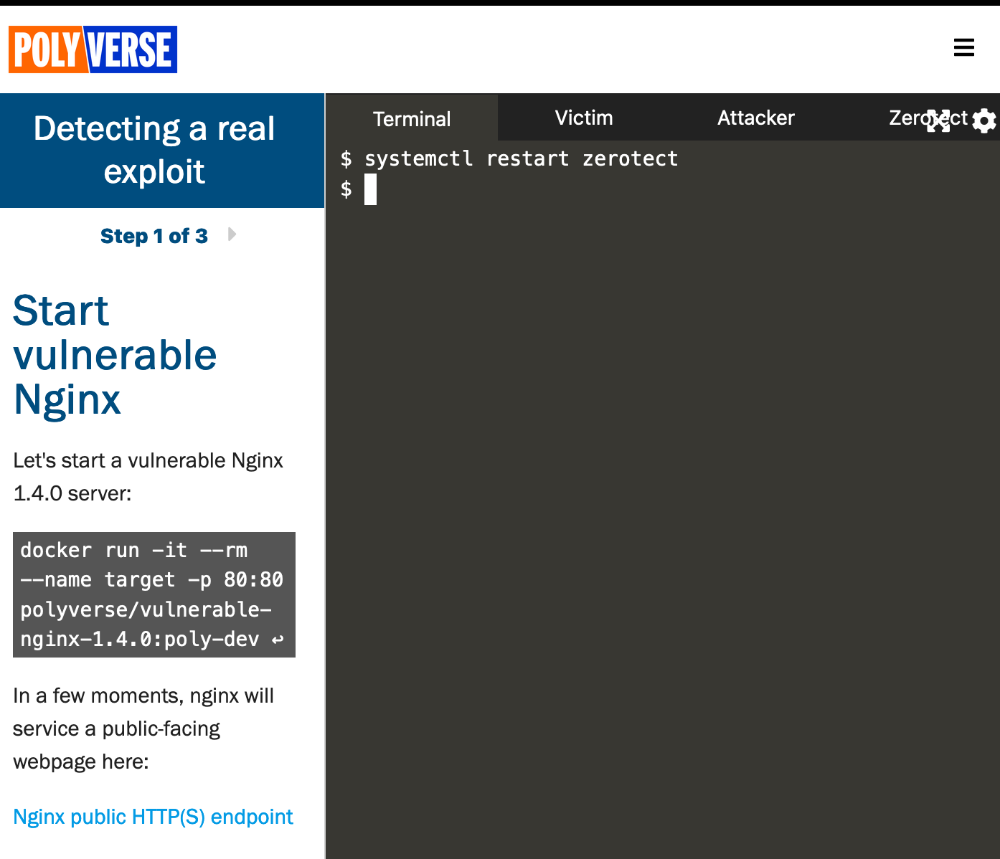
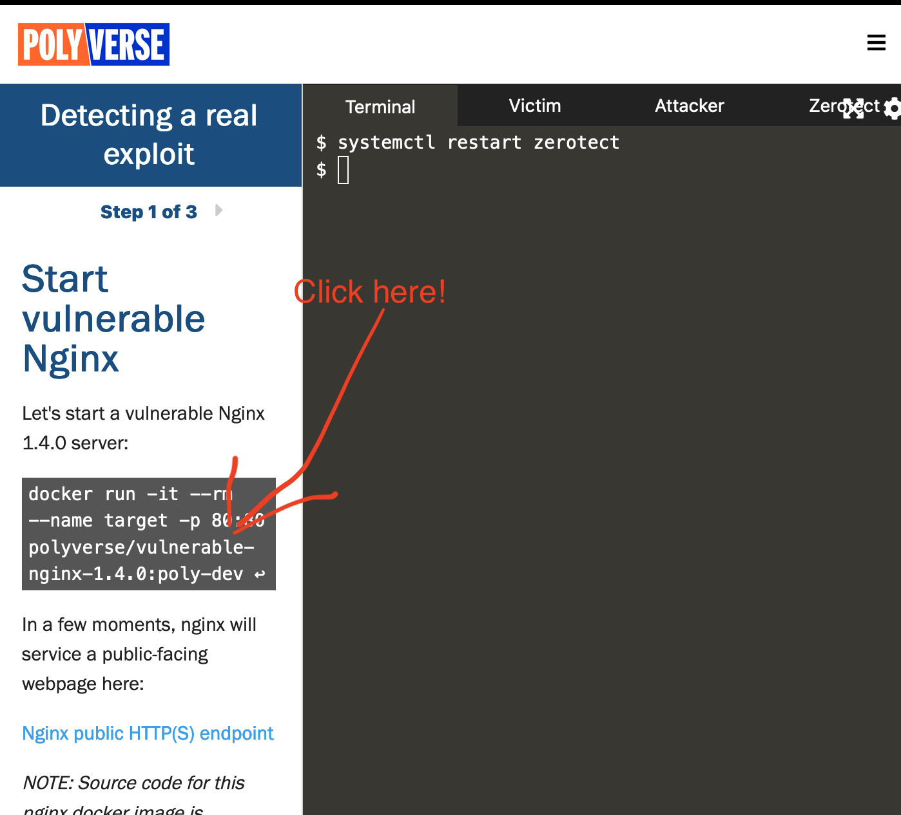
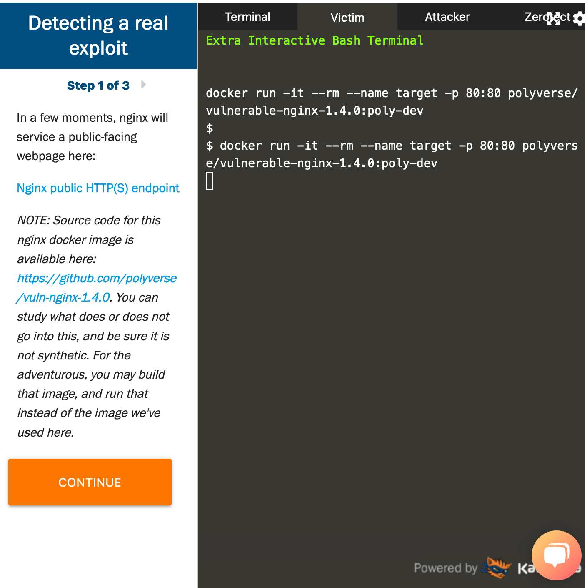
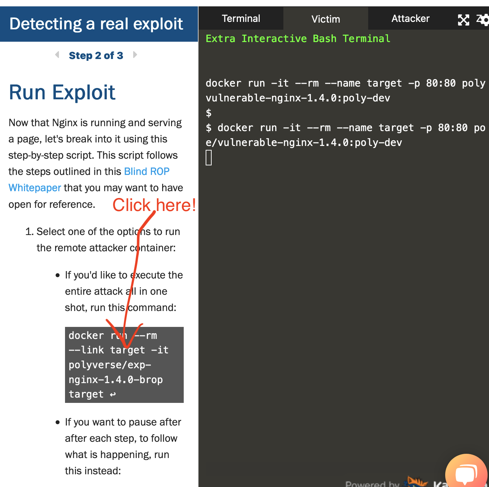

# PagerDuty Integration

## PagerDuty + Zerotect Integration Benefits

* Detect memory-based attacks in progress

## How it Works

Zerotect looks for faults (such as segmentation fault, protection fault, etc.) in the [kernel log buffer](https://www.kernel.org/doc/html/latest/core-api/printk-basics.html) and analyzes them in real-time to detect memory-based attacks in progress. When an attack is detected, an Event is raised in PagerDuty.

## Requirements

* PagerDuty integrations require an Admin base role for account authorization. If you do not have this role, please reach out to an Admin or Account Owner within your organization to configure the integration.
* Zerotect requires an integration key. Integration keys are generated by creating a new service or by creating a new integration for an existing service.

## Support

If you need help with this integration, please contact support@polyverse.com.

## Integration Walkthrough

### In PagerDuty

#### Integrating With a PagerDuty Service

1. From the **Configuration** menu, select **Services**.
2. There are two ways to add an integration to a service:
   * **If you are adding your integration to an existing service**: Click the **name** of the service you want to add the integration to. Then, select the **Integrations** tab and click the **New Integration** button.
   * **If you are creating a new service for your integration**: Please read our documentation in section [Configuring Services and Integrations](https://support.pagerduty.com/docs/services-and-integrations#section-configuring-services-and-integrations) and follow the steps outlined in the [Create a New Service](https://support.pagerduty.com/docs/services-and-integrations#section-create-a-new-service) section, selecting **Zerotect** as the **Integration Type** in step 4. Continue with the In  **Zerotect**  section (below) once you have finished these steps.
3. Enter an **Integration Name** in the format `monitoring-tool-service-name` (e.g.  **Zerotect**-Attack-Detections) and select  **Zerotect**  from the Integration Type menu.
4. Click the **Add Integration** button to save your new integration. You will be redirected to the Integrations tab for your service.
5. An **Integration Key** will be generated on this screen. Keep this key saved in a safe place, as it will be used when you configure the integration with  **Zerotect**  in the next section.


### In **ZeroTect**

1. Install Zerotect on any host with the following command:

```.bash
curl -s -L https://github.com/polyverse/zerotect/releases/latest/download/install.sh | sudo sh -s -- --pagerduty <integration key>
```

#### How to Uninstall

1. Uninstall Zerotect by running this command:

```.bash
curl -s -L https://github.com/polyverse/zerotect/releases/latest/download/install.sh | sudo sh -s -- --uninstall
```

## Testing PagerDuty integration

[Polyverse](https://polyverse.com) hosts an [online blind-rop attack demo](https://polyverse.com/learn/blind-rop/), which can be used to test incidents being raised in PagerDuty.

Note that this demo intentionally raises a LOT of incidents (it uses half a dozen attack techniques in one demo.) In reality you won't see more than one or two incidents as most zero-day attacks don't progress that rapidly and don't use all the techniques.

This is how you can run your own Blind-ROP attack and alert it in PagerDuty:

1. Go to this URL:
[https://polyverse.com/learn/blind-rop/](https://polyverse.com/learn/blind-rop/)

2. Press “Start Scenario”:


3. Run the install command: `curl -s -L https://github.com/polyverse/zerotect/releases/latest/download/install.sh | sudo sh -s -- --pagerduty cc00d5d00fd64703bb6a7872a6aee978`


4. Run: `systemctl restart zerotect`


5. Then start a vulnerable nginx by clicking on that gray text on the left side:


6. Scroll down and press continue…


7. Start the attack by clicking on this gray area on the left


And at this point just wait…. And the attack will generate alerts.

Every once in a while the step 2 will say, “Not Vulnerable”, so just repeat the steps in that case.
